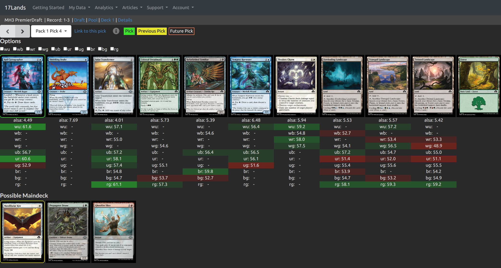

# 概要
17landsのピック画面に、デッキ色ごとのGIHを表示させる拡張機能です。

Tampermonkeyスクリプトとして動作します。

# 使い方
## TampermonkeyをChromeに追加
[Tampermonkey](https://chromewebstore.google.com/detail/tampermonkey/dhdgffkkebhmkfjojejmpbldmpobfkfo?hl=ja)を
Chromeの拡張機能として追加

Chomeの`設定 > 拡張機能 > 拡張機能の管理` へ行き、右上の`デベロッパーモードを有効にする` [^1]

[^1]: [Tampermonkey Changelog 5.2.0](https://www.tampermonkey.net/changelog.php#v5.2.0)

## 本スクリプトをTampermonkeyに追加
[ここをクリック](dist/react-userscripts.user.js?raw=1) すると、Tampermonkeyのインストール画面に飛びます。
